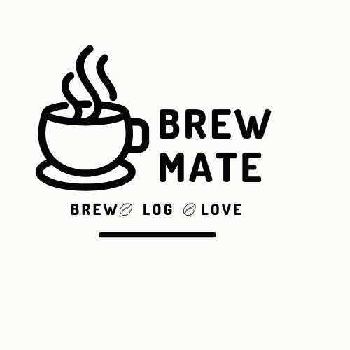

# BREWMATE



Welcome to your coffee dreams. THis is a place that you are able to log all of your favorites from beans to recipes.

I love coffee and to have all of my favorites in place was a dream. 

## User Story 
- As a guest I want to be able to have a landing page that tells me what the apps does. 
- As a user I wanted to be able to sign up and login.
- As a user I want to be able to create a new post where I can  upload images and details to either of the following catgeories: Coffee Beans  Favorite Coffee Shops Favorite Coffee recipes.
- As a user I want to be able to see my categories on its own pages. 
- As the author I want to be able to edit, delete and notate on my post and have its own individual links.


## ERD 


## WireFrame


https://www.canva.com/design/DAGXghPjcGA/2PfR58WIwx3x44IbIq0UMw/edit?utm_content=DAGXghPjcGA&utm_campaign=designshare&utm_medium=link2&utm_source=sharebutton


## Links

- ### Backend
https://brew-mate-app-1a60d3e40d9b.herokuapp.com/

- ### Deployed
https://yourbrewmate.netlify.app/signin


## Stretch Goals

- As a user I want to be able to interact with other users such as: 
--  Liking others post
--  Forum board
--  Able to upload photos
-- Commenting on other post 
- As a user I want to be able to upload a photo for my profile picture 
- As a user I want to have another category where I can upload videos of experience or how to videos (making recipes)


## Technology used: 
- VITE REACT 
- JAVASCRIPT
- CSS

## Stretch Goals:

- To get this code to render: 
```javascript
import {useState, useEffect, useContext} from 'react';
import { Link, useNavigate, useParams} from 'react-router-dom';
import { AuthedUserContext } from '../../App';

 
const CategoryLogs = () => {
    const { user } = useContext(AuthedUserContext);
    const { category } = useParams();
    const navigate = useNavigate();
    const [coffeeLogs, setCoffeelogs] = useState([]);
    const [loading, setLoading] = useState(true);
    const [error, setError] = useState(null);

    useEffect(() => {
        console.log('Fetching coffee logs for category:', category);
        const decodedCategory = decodeURIComponent(category);
    
        const fetchCoffeeLogs = async () => {
            if (!user?.token) {
                setError('You must be logged in to view coffee logs');
                setLoading(false);
                return;
            }
            try {
                const url = `${import.meta.env.VITE_EXPRESS_BACKEND_URL}/coffeelogs/${decodedCategory}`;
                console.log('Request URL:', url);
                const res = await fetch(url, {
                    headers: {
                        Authorization: `Bearer ${user.token}`,
                    },
                });
                if (!res.ok) {
                    const errorDetails = await res.text();
                    throw new Error(`Failed to load ${category}. Status: ${res.status}, Message: ${errorDetails}`)
                }
                const data = await res.json();
                if (Array.isArray(data) && data.length > 0) {
                    setCoffeelogs(data);
                } else {
                    setError('No logs found for this category.');
                }
            } catch (error) {
                setError(error.message);
            } finally {
                setLoading(false);
            }
        };
    
        if (user?.token) {
            fetchCoffeeLogs();
        }
    }, [category, user]);

    const handleEditClick = (coffeelogId) => {
        navigate(`/coffeelogs/${coffeelogId}/edit`);
    };

    if (loading) {
        return <main> Brewing up your logs....</main>
    }
    
    if (error) {
        console.log('Error fetching data:', error)
        return <p>Error: {error}</p>
    }

    if (!Array.isArray(coffeeLogs) || coffeeLogs.length === 0) {
        return (
            <>
            <h1> {category}</h1>
            <p> No {category} found! </p>
            </>
        );
    };
    return (
        <>
        <h1>{category}</h1>
        <ul>
            {coffeeLogs.map((coffeelog) => (
                <li key={coffeelog._id}>
                    <h3>Title: {coffeelog.title}</h3>
                    <p> Description: {coffeelog.description}</p>
                    <p> Location: {coffeelog.coffeeBeans?.location ||'N/A'}</p>
                    <p> Price range: {coffeelog.coffeeShops?.pricerange || 'N/A'}</p>
                    <p> Type: {coffeelog.type}</p>
                    <p>Shop Name: {coffeelog.coffeeShops?.shopname || 'N/a'}</p>
                    <p>Ingredients: {coffeelog.cofeeRecipes?.ingredients || 'N/A'}</p>
                    <p>Address: {coffeelog.coffeeShops?.address || 'N/A'}</p>
                    <button onClick={() => handleEditClick(coffeelog._id)}>Edit</button>
                </li>
              
            ))}
        </ul>
        </>
    );


    };


    export default CategoryLogs; ```


